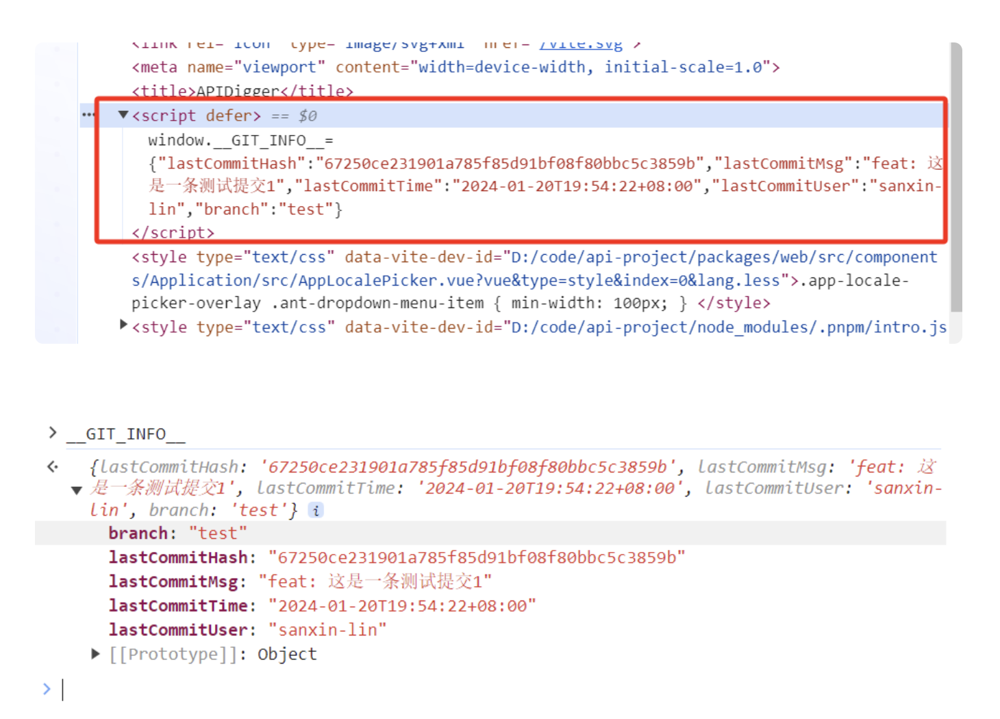

<!-- truncate -->

> 背景

在上线某一个平台的时候，CICD 部署上线后，发现了一个生产 BUG ，找到了代码原因后，进行了代码修改，然后进行部署上线，部署完后，发现了这个生产 BUG 还是存在！！！关掉缓存刷新、重启，这些都试过了，还是存在问题

- 部署成功了，为啥还有这个生产 BUG？
- 难道是 CICD 上提示部署成功，实际上没部署成功？
- 或者是部署成功了，但是代码依旧有问题？

<h4>总之就是一个问题：到底部署成功了没？</h4>

后面发现其实是没部署成功，虽然 CICD 上提示成功了，但是最后部署错镜像了，导致问题依旧存在

这件事情之后，我觉得应该搞个信息，每次上线的时候这个信息都能带到网页上去，这样我们就知道网页的代码到底是不是最新的了！！！

那应该带什么信息呢？其实带 Git 信息就可以了！！！比如：

- 当前 Git 的最后一次提交 hash
- 当前 Git 的最后一次提交 时间
- 等等

只要带上这些信息，就可以在部署后遇到问题的时候，能指导到底是不是部署成功了！

> 小练习

在做这个插件之前，先给大家一个小练习，咱们写一个 vite 插件，这个插件的作用是，在打包的时候，给 widnow 加一个变量

transformIndexHtml 是插件的一个钩子函数，可以在这个函数中去定义你想要塞哪些东西到 index.html 中

```

// vite-plugin-git-info.ts
import type { Plugin } from 'vite';
const plugin = (): Plugin =>{
  return {
    name:'vite-plugin-git-info',
    transformIndexHtm1(){
      return [
        {
          tag:'script'，// 插入的标签
          attrs: { defer: true }，// 标签的属性
          children:'window.constant = 2'，// 标签内的内容
          injectTo:"head'，// 插入到页面的哪个标签下
        }
      ]
    }
  }
}
export default plugin;
```

思路其实很简单，就是在 head 下新增一个 script 标签，内容是：window.constant = 2

接着在 vite.config.ts 中引入插件，并使用


然后启动页面，我们可以看到 head 标签下，出现了一个 script 标签，这个标签就是我们新增上去的


现在我们到控制台，看看能不能获取到 constant 这个全局变量，发现是可以获取到的


>举一反三

思路有了，其实想要加一些 Git 信息到网页上也不难了，无非就是通过调用命令行，把一些 Git 信息加到 window 下

先看一下我最新的一条 Git 提交，现在的任务就是把这个提交的一些信息，加到 window 下


插件的代码如下，代码量非常的少，有了这个插件，以后就不用再去猜到底部署成功没了~


