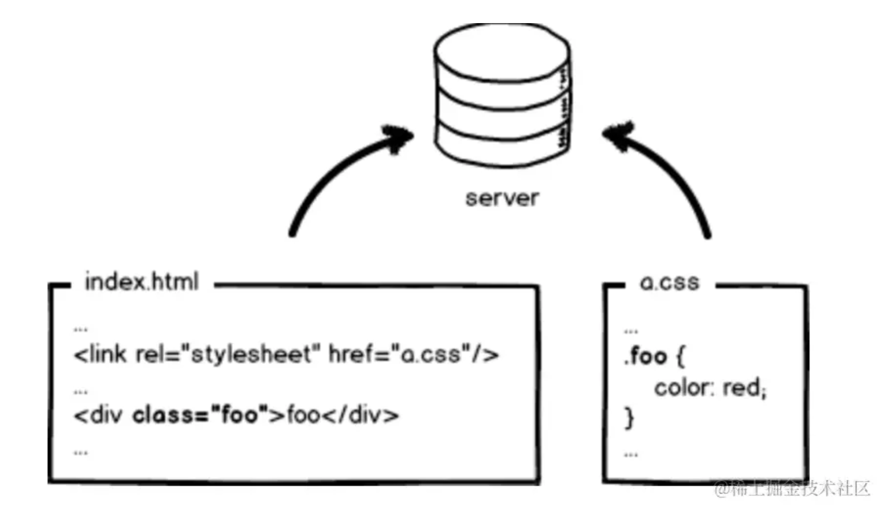
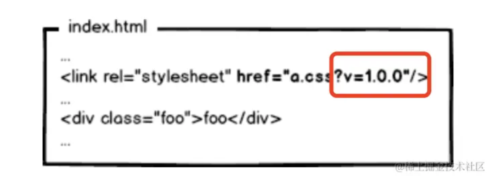
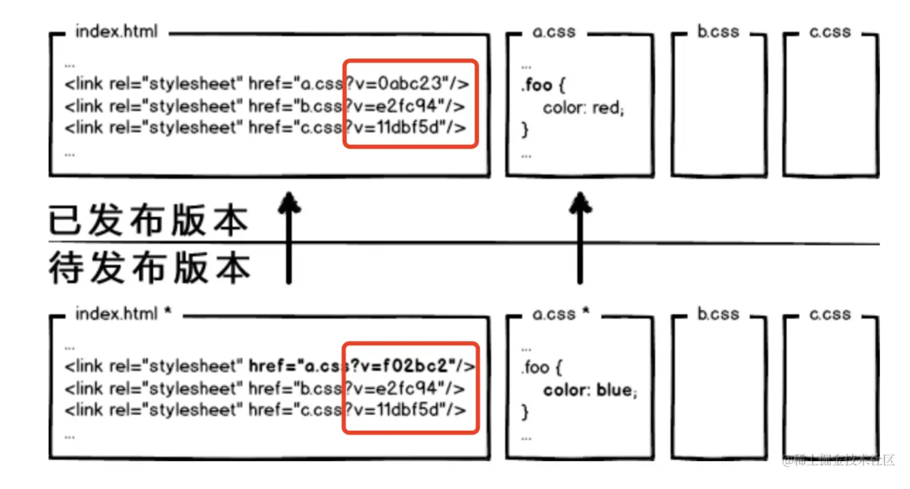
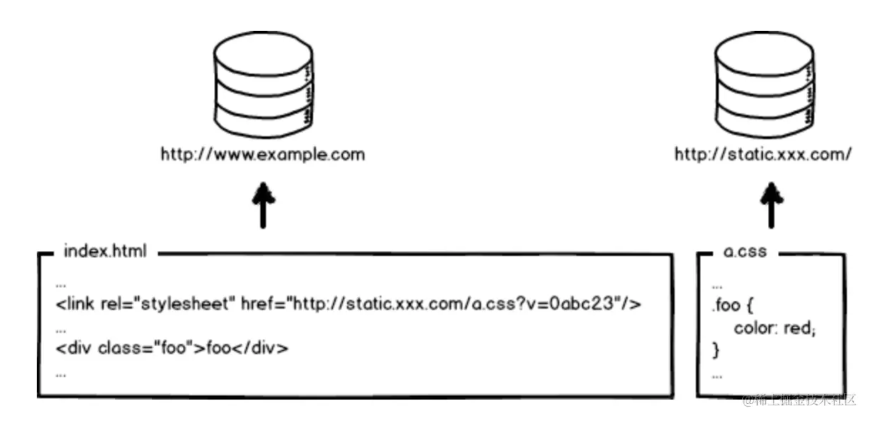
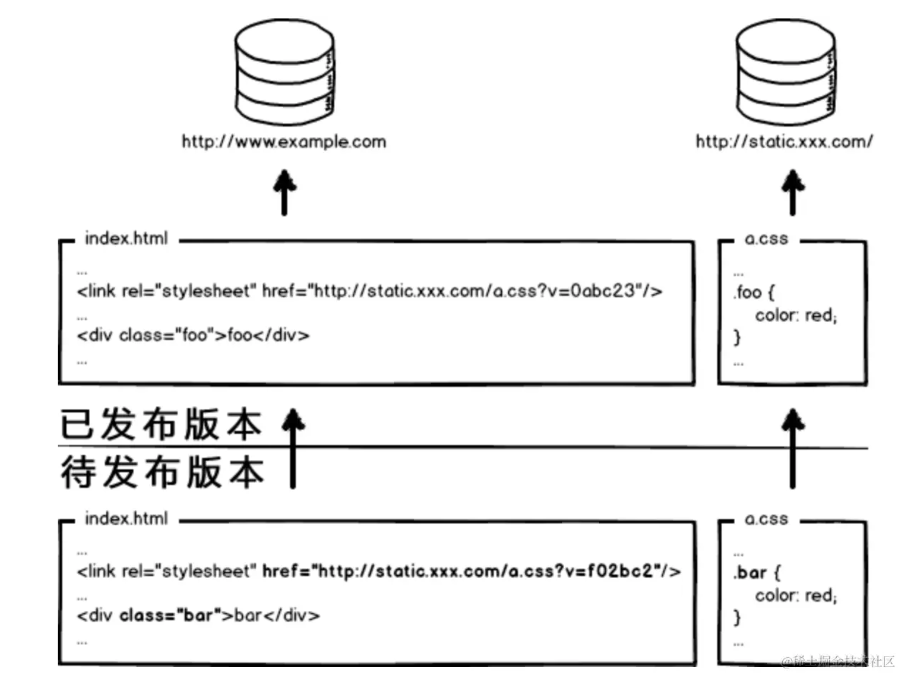
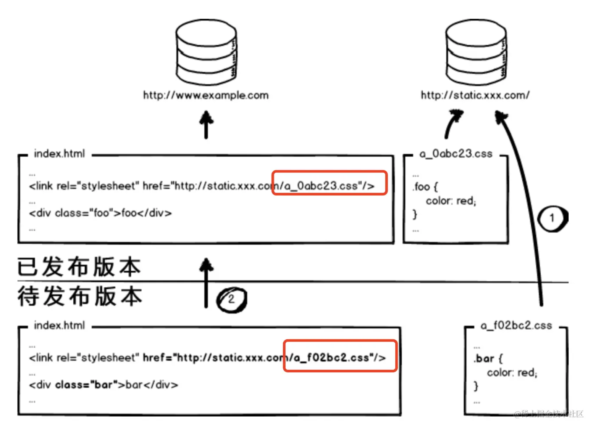
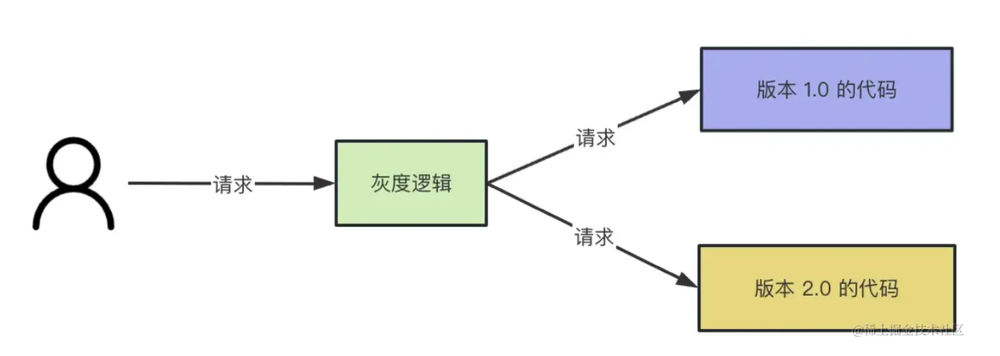
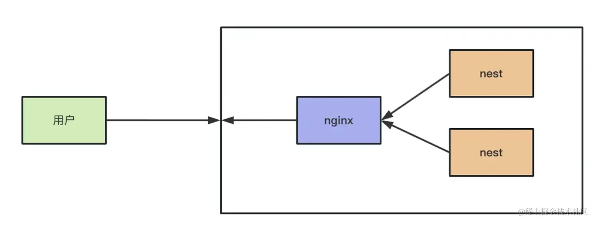

<!-- truncate -->

现在大部分的中小型公司部署前端代码都是比较简单的，主要步骤如下:

首先，通过脚手架提供的命令`npm run build`打包前端代码，生成`dist`文件夹；

最后，将`dist`文件夹丢给后台开发人员放在他们的工程里面，随后台一起部署；现在普遍是前后端分开部署，因此，利用`nginx`起一个`web`服务器，将`dist`文件夹放到指定的路径下，配置下nginx访问路径，对于请求接口使用`proxy_pass`进行转发，解决跨域的问题。

更加高端一点的操作，是利用`CI/CD + Docker`进行自动化部署。

但是，你是否真的想过前端部署真的就这么简单吗？

这其实是一个非常严肃且复杂的问题，因为这关系到线上生产环境的稳定。

有一天，从自知乎上看到一篇张云龙大佬在2014年写的文章，非常有启发，即使这篇文章距离现在有快10年了，但是其中的思想仍然熠熠生辉。

因为写的真的是太好了，为了让更多的人看到，所以大部分内容直接就照搬过来，为了让自己加深印象。

那让我们从原始的前端开发讲起。

下图是一个 `index.html` 页面和它的样式文件 `a.css`，无需编译，本地预览，丢到服务器，等待用户访问。

哇，前端这么简单，门槛好低啊。这也是前端有太多人涌入进来的原因。

接着，我们访问页面，看到效果，再查看一下网络请求，200！不错，太完美了！

那么，研发完成。。。。了么？

等等，这还没完呢！

对于像 BAT 这种公司来说，那些变态的访问量和性能指标，将会让前端一点也不好玩。

看看那个 `a.css` 的请求，如果每次用户访问页面都要加载，是不是很影响性能，很浪费带宽啊，我们希望最好这样：

利用`304`，让浏览器使用本地缓存。

但，这样也就够了吗？

不够！

`304`叫协商缓存，这玩意还是要和服务器通信一次，我们的优化级别是变态级，所以必须彻底灭掉这个请求，要变成这样：

强制浏览器使用本地缓存(`cache-control/expires`)，不要和服务器通信。

好了，请求方面的优化已经达到变态级别，那问题来了：你都不让浏览器发资源请求了，这缓存咋更新？

很好，相信有人想到了办法：通过更新页面中引用的资源路径，让浏览器主动放弃缓存，加载新资源。

像这样：

下次上线，把链接地址改成新的版本，这就更新资源了。

问题解决了么？当然没有，思考这种情况：

页面引用了3个`css` 文件，而某次上线只改了其中的`a.css`，如果所有链接都更新版本，就会导致`b.css`，`c.css`的缓存也失效，那岂不是又有浪费了？

不难发现，要解决这种问题，`必须让url的修改与文件内容关联，也就是说，只有文件内容变化，才会导致相应url的变更，从而实现文件级别的精确缓存控制`。

什么东西与文件内容相关呢？

我们会很自然的联想到利用`数据摘要要算法`对文件求摘要信息，摘要信息与文件内容一一对应，就有了一种可以精确到单个文件粒度的缓存控制依据了。

OK，那我们把 `url` 改成带摘要信息的：

这回再有文件修改，就只更新那个文件对应的 `url` 了，想到这里貌似很完美了。你觉得这就够了么？

图样图森破！

现代互联网企业，为了进一步提升网站性能，会把`静态资源和动态网页分集群部署`，静态资源会被部署到`CDN`节点上，网页中引用的资源也会变成对应的部署路径：

好了，当我要更新静态资源的时候，同时也会更新 html 中的引用吧，就好像这样：

这次发布，同时改了页面结构和样式，也更新了静态资源对应的url地址。现在重点来了，现在要发布代码上线，亲爱的前端研发同学，你来告诉我，`咱们是先上线页面，还是先上线静态资源？`

>这里的静态资源不仅仅包括css文件，也包括图片，以及不怎么经常变的资源。

1. `先部署动态页面，再部署静态资源：`在二者部署的时间间隔内，如果有用户访问页面，就会在新的页面结构中加载旧的资源，并且把这个旧版本的资源当做新版本缓存起来，其结果就是：用户访问到了一个样式错乱的页面，除非手动刷新，否则在资源缓存过期之前，页面会一直执行错误。

2. `先部署静态资源，再部署动态页面：`在部署时间间隔之内，有旧版本资源本地缓存的用户访问网站，由于请求的页面是旧版本的，资源引用没有改变，浏览器将直接使用本地缓存，这种情况下页面展现正常；但没有本地缓存或者缓存过期的用户访问网站，就会出现旧版本页面加载新版本资源的情况，导致页面执行错误，但当页面完成部署，这部分用户再次访问页面又会恢复正常了。

好的，上面一坨分析想说的就是：先部署谁都不成！都会导致部署过程中发生页面错乱的问题。

所以，`访问量不大的项目，可以让研发同学苦逼一把，等到半夜偷偷上线，先上静态资源，再部署页面，看起来问题少一些`。这也是很多公司的部署方案。

但是，大公司超变态，没有这样的绝对低峰期，只有相对低峰期。

所以，为了稳定的服务，还得继续追求极致啊！

这个奇葩问题，起源于资源的 `覆盖式发布`，用待发布资源覆盖已发布资源，就有这种问题。

解决它也好办，就是实现 `非覆盖式发布`。

看上图，用文件的摘要信息来对资源文件进行重命名，把摘要信息放到资源文件发布路径中，这样，内容有修改的资源就变成了一个新的文件发布到线上，不会覆盖已有的资源文件。上线过程中，`先全量部署静态资源，再灰度部署页面`，整个问题就比较完美的解决了。

因为很多前端开发同学不怎么接触部署，对灰度部署不太熟悉，下面将介绍下什么是灰度部署。

软件开发一般都是一个版本一个版本的迭代。新版本上线前都会经过测试，但就算这样，也不能保证上线了不出问题。

所以，在公司里上线新版本代码一般都是通过灰度系统。灰度系统可以把流量划分成多份，一份走新版本代码，一份走老版本代码。

而且灰度系统支持设置流量的比例，比如可以把走新版本代码的流程设置为 5%，没啥问题了再放到 10%，50%，最后放到 100% 全量。这样可以把出现问题的影响降到最低。

不然一上来就全量，万一出了线上问题，那就是大事故。

另外，灰度系统不止这一个用途，比如，产品不确定某些改动是不是有效的，就要做 AB 实验，也就是要把流量分成两份，一份走 A 版本代码，一份走 B 版本代码。

那这样的灰度系统是怎么实现的呢？其实很多都是用 `nginx` 实现的。

`nginx` 是一个反向代理的服务，用户请求发给它，由它转发给具体的应用服务器。

它的过程如下图所示：

首先，需要对流量进行染色，即对这个用户进行标注，让这个用户访问服务1，另外的用户访问服务2。染色的方式有很多，可以通过`cookie`来完成。不同的用户携带的`cookie`是不同的。第一染色的时候，所有的用户都访问服务1。

然后，第二次访问的时候，`nginx`根据用户携带的`cookie`进行转发到不同的服务，这样就完成了灰度访问。

好了，灰度部署就介绍到这里，回到原文讲的`先全量部署静态资源，再灰度部署页面`，这是什么意思呢？

首先，部署静态资源的时候，不要删除原来的静态资源，而是把新的静态资源发复制过去，因为文件名用摘要算法重命名的，所以不会发生重名的问题。

其次，灰度部署动态页面，也就是一部分用户访问老的页面，一部分用户访问新的页面。访问老页面的用户请求的还是老资源，直接使用缓存。访问新页面的用户访问新资源，此时新资源已经部署完成，所以不会访问老的资源，导致页面出现错误。

最后，根据访问情况，利用灰度系统，逐渐把访问老页面的用户过渡到访问新页面上。

所以，大公司的静态资源优化方案，基本上要实现这么几个东西：

1. 配置超长时间的本地缓存：节省带宽，提高性能

2. 采用内容摘要作为缓存更新依据：精确的缓存控制

3. 静态资源CDN部署：优化网络请求

4. 更资源发布路径实现非覆盖式发布：平滑升级

全套做下来，就是相对比较完整的静态资源缓存控制方案了，而且，还要注意的是，静态资源的缓存控制要求在`前端所有静态资源加载的位置都要做这样的处理`。

是的，所有！

什么js、css自不必说，还要包括js、css文件中引用的资源路径，由于涉及到摘要信息，引用资源的摘要信息也会引起引用文件本身的内容改变，从而形成级联的摘要变化，大概就是：

到这里本文结束了，我们已经了解了前端部署中关于静态资源缓存要面临的优化和部署问题，新的问题又来了：这™让工程师怎么写码啊！！！

这又会扯出一堆有关模块化开发、资源加载、请求合并、前端框架等等的工程问题。

妈妈，我再也不玩前端了。。。。

原文: https://juejin.cn/post/7316202725330796571 作者：小p
