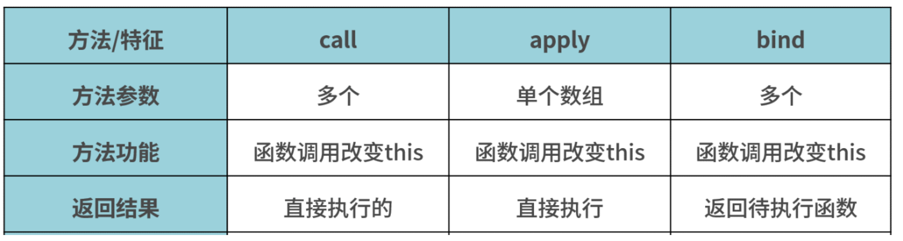

## This

>this指函数方法的直接调用者

>不同情况的调用，this指向分别如何。顺带可以提一下 es6 中箭头函数没有 this, arguments, super 等，这些只依赖包含箭头函数最接近的函数

```
function foo() {
  console.log(this.a)
}
var a = 1
foo()

const obj = {
  a: 2,
  foo: foo
}
obj.foo()

const c = new foo()
```

* 对于直接调用 foo 来说，不管 foo 函数被放在了什么地方，this 一定是window

* 对于 obj.foo() 来说，我们只需要记住，谁调用了函数，谁就是 this，所以在这个场景下 foo 函数中的 this 就是 obj 对象

* 对于 new 的方式来说，this 被永远绑定在了 c 上面，不会被任何方式改变 this


>this的绑定方式

* 默认绑定：全局环境中，this 默认绑定到 window。

* 隐式绑定：一般地，被直接对象所包含的函数调用时，也称为方法调用，this 隐式绑定到该直接对象。

* 显式绑定：通过 call()、apply()、bind()方法把对象绑定到 this 上，叫做显式绑定。

* new 绑定：如果函数或者方法调用之前带有关键字 new，它就构成构造函数调用。对于this 绑定来说，称为 new 绑定。


## apply/call/bind 



* 实现一个 bind 函数
```
Function.prototype.myBind = function (context) {
  if (typeof this !== 'function') {
    throw new TypeError('Error')
  }
  var _this = this
  var args = [...arguments].slice(1)
  // 返回一个函数
  return function F() {
    // 因为返回了一个函数，我们可以 new F()，所以需要判断
    if (this instanceof F) {
      return new _this(...args, ...arguments)
    }
    return _this.apply(context, args.concat(...arguments))
  }
}
```

* 实现一个 call 函数
```
Function.prototype.myCall = function (context) {
  var context = context || window
  // 给 context 添加一个属性
  // getValue.call(a, 'pp', '24') => a.fn = getValue
  context.fn = this
  // 将 context 后面的参数取出来
  var args = [...arguments].slice(1)
  // getValue.call(a, 'pp', '24') => a.fn('pp', '24')
  var result = context.fn(...args)
  // 删除 fn
  delete context.fn
  return result
}
```

* 实现一个 apply 函数
```
Function.prototype.myApply = function(context = window, ...args) {
  // this-->func  context--> obj  args--> 传递过来的参数

  // 在context上加一个唯一值不影响context上的属性
  let key = Symbol('key')
  context[key] = this; // context为调用的上下文,this此处为函数，将这个函数作为context的方法
  // let args = [...arguments].slice(1)   //第一个参数为obj所以删除,伪数组转为数组
  
  let result = context[key](...args); 
  delete context[key]; // 不删除会导致context属性越来越多
  return result;
}
```